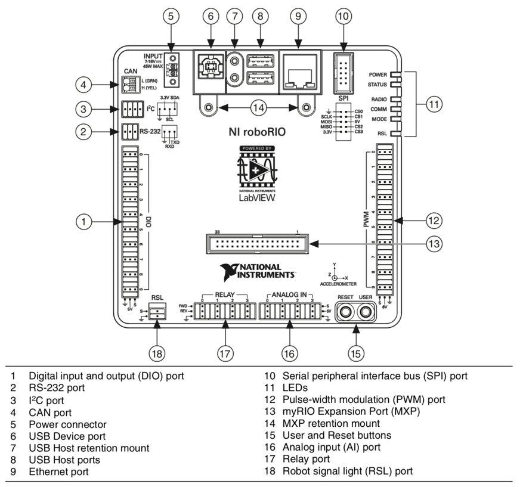

# roboRIO

The Brains of the Bot!

## The roboRIO Basics

- The roboRIO is the brain of an FRC robot.
- It is the main processing unit and is where the code is stored and run.
- It is very similar to something like a Raspberry Pi, it’s a mini computer!
- The roboRIO can connect to many different devices such as **motor controllers, servos, and sensors** through its various interface connections such as:
    - **Digital I/O, PWM, CAN Bus, Ethernet, USB, MXP**

***

## The roboRIO IO

- **Digital IO** (DIO) used for sensors and switches
- **PWM** used for motor controllers and servos
- **CAN** used for motor controllers and sensors
- **MXP** used for functionality expansion
- Check the roboRIO [user manual](http://www.ni.com/pdf/manuals/375274a.pdf){target=_blank} for more details

