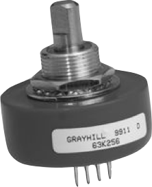

# Sensors

How does the robot see?

## Some types of sensors

- **Limit Switches** - detects contact
- **Camera** - provides sight
- **Encoders** - measures rotational or linear motion
- **Ultrasonic** - measures distances
- **Gyroscope** - measures orientation
- **Processed Vision** - measures target's distance, angle, and offset from robot
- For more info on sensors see: [High Tech High Top Hat Technicians](http://tophattechnicians.com) - [Electrical Tutorial](https://drive.google.com/file/d/1ip54fjNDFaq-ZWw9lQrZj6vXamX33QDP/view)

|                    Limit Switch                    |         Grayhill brand Quadrature Encoder         |   Kauai Labs navX Gryo/ Accelerometer    |
| :------------------------------------------------: | :-----------------------------------------------: | :--------------------------------------: |
|  |  |  |
