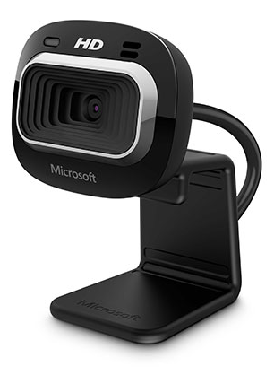

# Sensors

How does the robot see?

## Some types of sensors

- **Limit Switches** - detects contact
- **Camera** - provides sight
- **Encoders** - measures rotational or linear motion
- **Ultrasonic** - measures distances
- **Gyroscope** - measures orientation
- **Processed Vision** - measures target's distance, angle, and offset from robot
- For more info on sensors see: [High Tech High Top Hat Technicians](http://tophattechnicians.com){target=_blank} - [Electrical Tutorial](https://drive.google.com/file/d/1ip54fjNDFaq-ZWw9lQrZj6vXamX33QDP/view){target=_blank}

|                        Limit Switch                        |             Grayhill brand Quadrature Encoder             |       Kauai Labs navX Gryo/ Accelerometer        |
| :--------------------------------------------------------: | :-------------------------------------------------------: | :----------------------------------------------: |
|  |  |  |
