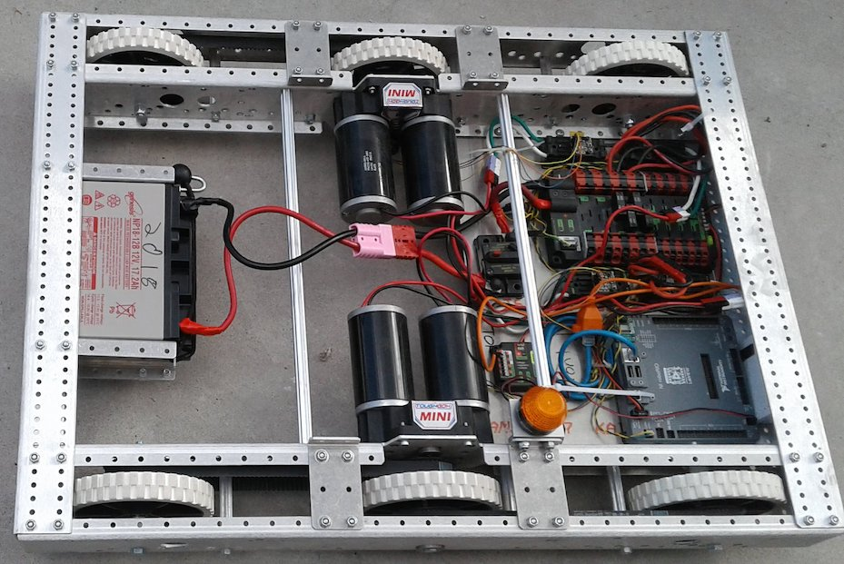
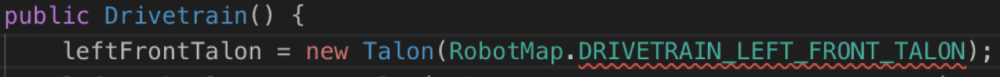
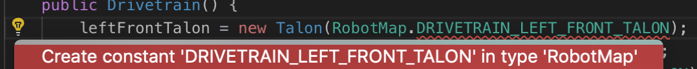
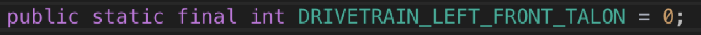

# **WIP** Creating a Basic Driving Robot

<!-- TODO: Maybe split this into different pages -->

Lets get moving!


> [Picture source: Team 2984](http://ljrobotics.org/games/power-up-2018/){target=_blank}

## Overview

In this section we will be going over:

1. Creating the basic Drivetrain subsystem
2. Adding subsystems to Robot.java, the main file that the robot runs and all other files must be in some way connected to.
3. Creating joysticks and using their axes to control the robot.
4. Creating and using DifferentialDrive and ArcadeDrive to make controlling the robot’s motors an easy process.
5. Deploying code to the roboRIO

***

## Creating the Drivetrain Subsystem

Before we begin we must create the class file for the drivetrain subsystem. See [Creating a New Subsystem](new_project.md#creating-a-new-subsystem){target=_blank} for info on how to do this.

### What will be added to the Drivetrain

In the Drivetrain class we will tell the subsystem what type of components it will be using.

- A Drivetrain needs motor controllers. In our case we will use 4 Talon SRs (a brand of controller for motors).
    - You could use other motor controllers such as Victor SPs or Talon SRXs but we will be using Talon SRs
      - If you are, replace Talon with TalonSRX, Victor, or VictorSP in the code you write depending on the type you use.
    - You can use 2 motors (left and right), but for this tutorial we will use 4.

!!! Tip
		Be sure to read [Visual Studio Code Tips](../basics/vscode_tips.md){target=_blank} before getting started! It will make your life a lot easier.

### Creating the Talon Variables

!!! summary ""
    **1)** Create 4 global variables of data type **Talon** and name them: `leftFrontTalon`, `rightFrontTalon`, `leftBackTalon`, `rightBackTalon`
   
    - To get started type the word Talon followed by the name i.e. `#!java Talon leftFrontTalon;`
    - These will eventually hold the object values for Talons and their port numbers.

!!! summary ""
    **2)** Next assign their values to `#!java null` ([more info on `null`](../basics/java_basics.md#overview){target=_blank}).
   
    - We do this to make sure it is empty at this point. 
    - When we assign these variables a value, we will be getting the motor controller's port numbers out of RobotMap
        - This means we cannot assign them at the global level

??? Example

	The code you typed should be this:

    ```java
    Talon leftFrontTalon = null;
    Talon leftBackTalon = null;
    Talon rightFrontTalon = null;
    Talon rightBackTalon = null;
    ```

	Your full **Drivetrain.java** should look like this:

    ```java
    package frc.robot.subsystems;

    import edu.wpi.first.wpilibj.Talon;
    import edu.wpi.first.wpilibj.command.Subsystem;

    /**
     * Add your docs here.
     */
    public class Drivetrain extends Subsystem {
      // Put methods for controlling this subsystem
      // here. Call these from Commands.

      Talon leftFrontTalon = null;
      Talon leftBackTalon = null;
      Talon rightFrontTalon = null;
      Talon rightBackTalon = null;

      @Override
      public void initDefaultCommand() {
        // Set the default command for a subsystem here.
        // setDefaultCommand(new MySpecialCommand());
      }
    }
	```
<!-- TODO: Generalize this more -->

??? fail "If an error occurs (red squiggles)"
	1. Click the word Talon
	
	2. 💡 Click the light bulb  
	
	3. Select "Import 'Talon' (edu.wpi.first.wpilibj)"
	
	4. Your error should be gone!

### Creating and filling the constructor

!!! summary ""
    **1)** Create the constructor for Drivetrain.java ([more info on constructors](../basics/java_basics.md#constructors){target=_blank})
   
    - The constructor is where we will assign values to our talon variables.

!!! summary ""
	Now that we have created the Talons we must initialize them and tell them what port on the roboRIO they are on.

    **2)** Initialize (set value of) `leftFrontTalon` to `#!java new Talon(0)`. 
      
	- This initializes a new talon, `leftFrontTalon`, in a new piece of memory and states it is on port 0 of the roboRIO. 
	- This should be done within the constructor `#!java Drivetrain()`
	- This calls the constructor `#!java Talon(int)` in the Talon class. 
    	- The constructor `#!java Talon(int)` takes a variable of type `#!java int`. In this case the `#!java int` (integer) refers to the port number on the roboRIO. 
  		
		??? Info "roboRIO port diagram"
    		  

??? Example

	The code you typed should be this:

    ```java
    public Drivetrain() {
      // Talons
      leftFrontTalon = new Talon(0);
    }
    ```

	Your full **Drivetrain.java** should look like this:

    ```java
    package frc.robot.subsystems;

    import edu.wpi.first.wpilibj.Talon;
    import edu.wpi.first.wpilibj.command.Subsystem;

    /**
     * Add your docs here.
     */
    public class Drivetrain extends Subsystem {
      // Put methods for controlling this subsystem
      // here. Call these from Commands.

      Talon leftFrontTalon = null;
      Talon leftBackTalon = null;
      Talon rightFrontTalon = null;
      Talon rightBackTalon = null;

	  public Drivetrain() {
        // Talons
        leftFrontTalon = new Talon(0);
      }

      @Override
      public void initDefaultCommand() {
        // Set the default command for a subsystem here.
        // setDefaultCommand(new MySpecialCommand());
      }
    }
	```

### Using RobotMap

<!-- TODO: Link this as example where robot map mentioned -->

Since each subsystem has its own components with their own ports, it is easy to lose track of which ports are being used and for what. To counter this you can use a class called **RobotMap** to hold all these values in a single location.

!!! summary ""
    **1)** To use RobotMap, instead of putting `0` for the port on the Talon type: 
	```java
	RobotMap.DRIVETRAIN_LEFT_FRONT_TALON
	```
   
    - Names should follow the pattern SUBSYSTEM_NAME_OF_COMPONENT
    - The name is all caps since it is a **constant** ([more info on constants](../basics/java_basics.md#constants){target=_blank}).

!!! summary ""
    **2)** Click on the underlined text 
	

!!! summary ""
	**3)** Click on the 💡light bulb and select “create constant…”
	
	
!!! summary ""
	**4)** Click on RobotMap.java tab that just popped up
	  
	
!!! summary ""
	**5)** Change the `0` to the correct port for that motor controller on your robot/roboRIO
	
	
	!!! Danger
		***If you set this to the wrong value, you could damage your robot when it tries to move!***
   
!!! summary ""
	**6)** Repeat these steps for the remaining Talons.

	!!! Tip
    	Remember to save both **Drivetrain.java** and **RobotMap.java**

??? Example

	The code you type should be this:

    ```java
    leftFrontTalon = new Talon(RobotMap.DRIVETRAIN_LEFT_FRONT_TALON);
    ```

	Your full **Drivetrain.java** should look like this:

    ```java
    package frc.robot.subsystems;

    import edu.wpi.first.wpilibj.Talon;
    import edu.wpi.first.wpilibj.command.Subsystem;
    import frc.robot.RobotMap;

    /**
     * Add your docs here.
     */
    public class Drivetrain extends Subsystem {
      // Put methods for controlling this subsystem
      // here. Call these from Commands.

      Talon leftFrontTalon = null;
      Talon leftBackTalon = null;
      Talon rightFrontTalon = null;
      Talon rightBackTalon = null;

      public Drivetrain() {
        // Talons
        leftFrontTalon = new Talon(RobotMap.DRIVETRAIN_LEFT_FRONT_TALON);
        leftBackTalon = new Talon(RobotMap.DRIVETRAIN_LEFT_BACK_TALON);
        rightFrontTalon = new Talon(RobotMap.DRIVETRAIN_RIGHT_FRONT_TALON);
        rightBackTalon = new Talon(RobotMap.DRIVETRAIN_RIGHT_BACK_TALON);
      }

      @Override
      public void initDefaultCommand() {
        // Set the default command for a subsystem here.
        // setDefaultCommand(new MySpecialCommand());
      }
    }
	```

	Your full **RobotMap.java** should look similar to this:	

    ```java
    package frc.robot;

    public class RobotMap {
	  // Talons
      public static final int DRIVETRAIN_LEFT_FRONT_TALON = 0;
      public static final int DRIVETRAIN_LEFT_BACK_TALON = 1;
      public static final int DRIVETRAIN_RIGHT_FRONT_TALON = 2;
      public static final int DRIVETRAIN_RIGHT_BACK_TALON = 3;
    }
	```

	!!! Warning
      	Remember to use the values for **YOUR** specific robot or you could risk damaging it!

### Creating the arcade drive

#### What is the Drive Class

- The FIRST Drive class has many pre-configured methods available to us including DifferentialDrive, and many alterations of MecanumDrive.
- DifferentialDrive contains subsections such as TankDrive and ArcadeDrive.
    <!-- TODO: add back - For more information and details on drive bases see the WPILib documentation -->
- For our tutorial we will be creating an ArcadeDrive
- Arcade drives run by taking a moveSpeed and rotateSpeed. moveSpeed defines the forward and reverse speed and rotateSpeed defines the turning left and right speed.
- To create an arcade drive we will be using our already existing Drivetrain class and adding to it.

#### Programing a RobotDrive

<!-- TODO: Add instructions for TalonSRX -->

!!! summary ""
    **1)** In the same place we created our talons (outside of the constructor) we will create a **DifferentialDrive** and **SpeedControllerGroups** for our left and right motor controllers.

    Outside of the constructor type:
  
    ```java
    SpeedControllerGroup leftMotors = null;
    SpeedControllerGroup rightMotors = null;
    
    DifferentialDrive differentialDrive = null;
    ```

    - Since DifferentialDrive only takes 2 parameters we need to create speed controller groups to combine like motor controllers together.
        - In this case we will combine the left motors together and the right motors together.

    !!! Warning
        You should only group motors that are spinning the same direction physically when positive power is being applied otherwise you could damage your robot.

!!! summary ""
    **2)** Now we must initialize the **SpeedControllerGroups** and **DifferentialDrive** like we did our talons. ...

    In the constructor type:
  
    ```java
    leftMotors = new SpeedControllerGroup(leftFrontTalon, leftBackTalon);
    rightMotors = new SpeedControllerGroup(rightFrontTalon, rightBackTalon);

    differentialDrive = new DifferentialDrive(leftMotors, rightMotors);
    ```

??? Example

	The code you type outside the constructor should be this:

    ```java
    SpeedControllerGroup leftMotors = null;
    SpeedControllerGroup rightMotors = null;
    
    DifferentialDrive differentialDrive = null;
    ```

	The code you type inside the constructor should be this:

    ```java
    leftMotors = new SpeedControllerGroup(leftFrontTalon, leftBackTalon);
    rightMotors = new SpeedControllerGroup(rightFrontTalon, rightBackTalon);

    differentialDrive = new DifferentialDrive(leftMotors, rightMotors);
    ```

	Your full **Drivetrain.java** should look like this:

    ```java
    package frc.robot.subsystems;

    import edu.wpi.first.wpilibj.SpeedControllerGroup;
    import edu.wpi.first.wpilibj.Talon;
    import edu.wpi.first.wpilibj.command.Subsystem;
    import edu.wpi.first.wpilibj.drive.DifferentialDrive;
    import frc.robot.RobotMap;

    /**
     * Add your docs here.
     */
    public class Drivetrain extends Subsystem {
      // Put methods for controlling this subsystem
      // here. Call these from Commands.

      Talon leftFrontTalon = null;
      Talon leftBackTalon = null;
      Talon rightFrontTalon = null;
      Talon rightBackTalon = null;

      SpeedControllerGroup leftMotors = null;
      SpeedControllerGroup rightMotors = null;

      DifferentialDrive differentialDrive = null;

      public Drivetrain() {
        // Talons
        leftFrontTalon = new Talon(RobotMap.DRIVETRAIN_LEFT_FRONT_TALON);
        leftBackTalon = new Talon(RobotMap.DRIVETRAIN_LEFT_BACK_TALON);
        rightFrontTalon = new Talon(RobotMap.DRIVETRAIN_RIGHT_FRONT_TALON);
        rightBackTalon = new Talon(RobotMap.DRIVETRAIN_RIGHT_BACK_TALON);

        leftMotors = new SpeedControllerGroup(leftFrontTalon, leftBackTalon);
        rightMotors = new SpeedControllerGroup(rightFrontTalon, rightBackTalon);

        differentialDrive = new DifferentialDrive(leftMotors, rightMotors);
      }

      @Override
      public void initDefaultCommand() {
        // Set the default command for a subsystem here.
        // setDefaultCommand(new MySpecialCommand());
      }
    }
	```

#### Creating the arcadeDrive method

Now it’s time to make an arcadeDrive from our differentialDrive!

!!! summary ""
    **1)** Let’s create a public void method called “arcadeDrive” with type “double” parameters moveSpeed and rotateSpeed.

    Below the constructor type:

    ```java
    public void arcadeDrive(double moveSpeed, double rotateSpeed) {

    }
    ```

    !!! Tip
        By putting something in the parentheses it makes the method require a parameter when it is used. When the method gets used and parameters are passed, they will be store in moveSpeed and rotateSpeed (in that order). See [parameters](../basics/java_basics.md#parameters){target=_blank} for more info.

!!! summary ""
    **2)** Now lets make our method call the differentialDrive's arcadeDrive method.

    Inside our method type:

    ```java
    differentialDrive.arcadeDrive(moveSpeed, rotateSpeed);
    ```

    DifferentialDrive's arcadeDrive method takes parameters moveValue and rotateValue.

    !!! Note
        At this point you could instead create a tank drive, however implementation differs slightly.
        To do so type `#!java differentialDrive.tankDrive(moveSpeed, rotateSpeed);` instead of `#!java differentialDrive.arcadeDrive(moveSpeed, rotateSpeed);` and change the method name reflect this.

    !!! Tip
        If you want to limit the max speed you can multiple the speeds by a decimal (i.e. 0.5*moveSpeed will make the motors only move half of their maximum speed)

        You may want to do this for initial testing to make sure everything is going the right direction.

??? Example

	The code you type should be this:

    ```java
    public void arcadeDrive(double moveSpeed, double rotateSpeed) {
      differentialDrive.arcadeDrive(moveSpeed, rotateSpeed);
    }
    ```
  
	Your full **Drivetrain.java** should look like this:

    ```java
    package frc.robot.subsystems;

    import edu.wpi.first.wpilibj.SpeedControllerGroup;
    import edu.wpi.first.wpilibj.Talon;
    import edu.wpi.first.wpilibj.command.Subsystem;
    import edu.wpi.first.wpilibj.drive.DifferentialDrive;
    import frc.robot.RobotMap;

    /**
     * Add your docs here.
     */
    public class Drivetrain extends Subsystem {
      // Put methods for controlling this subsystem
      // here. Call these from Commands.

      Talon leftFrontTalon = null;
      Talon leftBackTalon = null;
      Talon rightFrontTalon = null;
      Talon rightBackTalon = null;

      SpeedControllerGroup leftMotors = null;
      SpeedControllerGroup rightMotors = null;

      DifferentialDrive differentialDrive = null;

      public Drivetrain() {
        // Talons
        leftFrontTalon = new Talon(RobotMap.DRIVETRAIN_LEFT_FRONT_TALON);
        leftBackTalon = new Talon(RobotMap.DRIVETRAIN_LEFT_BACK_TALON);
        rightFrontTalon = new Talon(RobotMap.DRIVETRAIN_RIGHT_FRONT_TALON);
        rightBackTalon = new Talon(RobotMap.DRIVETRAIN_RIGHT_BACK_TALON);

        leftMotors = new SpeedControllerGroup(leftFrontTalon, leftBackTalon);
        rightMotors = new SpeedControllerGroup(rightFrontTalon, rightBackTalon);

        differentialDrive = new DifferentialDrive(leftMotors, rightMotors);
      }

      public void arcadeDrive(double moveSpeed, double rotateSpeed) {
        differentialDrive.arcadeDrive(moveSpeed, rotateSpeed);
      }

      @Override
      public void initDefaultCommand() {
        // Set the default command for a subsystem here.
        // setDefaultCommand(new MySpecialCommand());
      }
    }
	```

## Making our robot controllable

### Creating the Joystick

In order to drive our robot, it needs to know what will be controlling it. To do so, we will create a new joystick in OI.java

!!! summary ""
    **1)** Open OI.java

    **2)** Type: 
	```java 
	public Joystick driverController = new Joystick(RobotMap.OI_DRIVER_CONTROLLER);
	```

	<!-- TODO: Change this to a general fix imports -->

	- Import any classes if necessary such as: `#!java import edu.wpi.first.wpilibj.Joystick;` 
    - A variable `driverController` of type Joystick pointing to a joystick on port `OI_DRIVER_CONTROLLER` from **RobotMap**

	**3)** Click the 💡 light bulb to create a new **CONSTANT** and set the value to the port number the joystick uses on the laptop (this can be found in the Driverstation software).

<!-- TODO: add details on how to find joystick port in driverstation tips -->

??? Example

	The code you type should be this:

    ```java
    public Joystick driverController = new Joystick(RobotMap.OI_DRIVER_CONTROLLER);
    ```

	Your full **OI.java** should look like this:

    ```java
    package frc.robot;

    import edu.wpi.first.wpilibj.Joystick;

    /**
     * This class is the glue that binds the controls on the physical operator
     * interface to the commands and command groups that allow control of the robot.
     */
    public class OI {
      public Joystick driverController = new Joystick(RobotMap.OI_DRIVER_CONTROLLER);
    }
	```

	Your full **RobotMap.java** should look similar to this:	

    ```java
    package frc.robot;

    public class RobotMap {
	  // Talons
      public static final int DRIVETRAIN_LEFT_FRONT_TALON = 0;
      public static final int DRIVETRAIN_LEFT_BACK_TALON = 1;
      public static final int DRIVETRAIN_RIGHT_FRONT_TALON = 2;
      public static final int DRIVETRAIN_RIGHT_BACK_TALON = 3;

	  // Joysticks
      public static final int OI_DRIVER_CONTROLLER = 0;
    }
	```

### Creating the DriveArcade Command

- Remember that **methods** tell the robot what it can do but in order to make it do these things we must give it a **command**. See [Command Based Robot](../basics/wpilib.md#command-based-robot){target=_blank}
- Now that we have created the method, we need to create a command to call and use that method.
- Let’s create a new command called **DriveArcade** that calls arcadeDrive method we just created!

Before we begin we must create the class file for the DriveArcade command. See [Creating a New Command](new_project.md#creating-a-new-command){target=_blank} for info on how to do this and info on what each pre-created method does.

#### In the constructor

!!! summary ""
    **1)** In the constructor `#!java DriveArcade()` type:

    ```java
    requires(Robot.m_drivetrain);
    ```
   
    - This means, this command will end all other commands currently using drivetrain and will run instead when executed.
    - It also means, other commands that require drivetrain will stop this command and run instead when executed.

    !!! Warning
        If you use the light bulb to import ‘Robot’. Be sure to import the one with “frc.robot”

#### In the execute method

!!! summary ""
    **1)** In the execute method we will create 2 variables of type double called moveSpeed and rotateSpeed.

    - We want these variables to be the value of the axis of the controller we are using to drive the robot. So we will set them equal to that by using the joystick getRawAxis method.
    - Controllers return an axis value between 1 and -1 to indicate how far the joystick is pushed up or down. Our personal controller returns up as -1 so we want to invert it.
        - In Java you can put a negative “ - “in front of a numeric value to invert it (value * -1)
        - The joystick’s getRawAxis method will get the position value of the axis as you move it. The method takes parameter “axis number.” (This can be found in the Driverstation software and we will store it in RobotMap).

    In the execute() method type:

    ```java
    double moveSpeed = -Robot.m_oi.driverController.getRawAxis(RobotMap.DRIVER_CONTROLLER_MOVE_AXIS);
    double rotateSpeed = Robot.m_oi.driverController.getRawAxis(RobotMap.DRIVER_CONTROLLER_ROTATE_AXIS);
    ```

    !!! Tip
        Remember to use the light bulb for importing and creating constants if needed!

!!! summary ""
    **2)** Also in the execute method we will we want to call the **arcadeDrive** method we created in **Drivetrain** and give it the variables **moveSpeed** and **rotateSpeed** we created as parameters.

    In the execute() method below rotateSpeed type:

    ```java
    Robot.m_drivetrain.arcadeDrive(moveSpeed, rotateSpeed);
    ```

#### In the isFinished method

Since we will be using this command to control the robot we want it to run indefinitely.

!!! summary ""
    **1)** To do this we are going to continue having isFinished return false, meaning the command will never finish. 
    
    (We don't need to change anything as this is the default)

    !!! Tip
        - If we did want a command to finish, we make this return true.
          - This can be done by replacing false with true to make it finish instantly
          - Alternatively we can make a condition which can return true
              - For example `(timePassed > 10)` will return true after 10 seconds but return false anytime before 10 seconds have passed.

#### In the end method

!!! summary ""
    **1)** We will call the arcadeDrive method and give it 0 and 0 as the parameters. 

    In the end() method type:

    ```java
    Robot.m_drivetrain.arcadeDrive(0, 0);
    ```

    - This make the motors stop running when the command ends by setting the movement speed to zero and rotation speed to zero.

#### In the interrupted method

!!! summary ""
    **1)** We will make it call end. 

    In the interrupted() method type:

    ```java
    end();
    ```

    - This makes the end method get called if the command gets interrupted. (No reason to re-write code, call end() to use what we already have!)

#### Completed Example

??? Example

	Your full **RobotMap.java** should look similar to this:	

    ```java
    package frc.robot;

    public class RobotMap {
  	  // Talons
      public static final int DRIVETRAIN_LEFT_FRONT_TALON = 0;
      public static final int DRIVETRAIN_LEFT_BACK_TALON = 1;
      public static final int DRIVETRAIN_RIGHT_FRONT_TALON = 2;
      public static final int DRIVETRAIN_RIGHT_BACK_TALON = 3;

  	  // Joysticks
      public static final int OI_DRIVER_CONTROLLER = 0;
      public static final int DRIVER_CONTROLLER_MOVE_AXIS = 1; // Change for your controller
      public static final int DRIVER_CONTROLLER_ROTATE_AXIS = 2; // Change for your controller
    }
	```

	Your full **DriveArcade.java** should look like this:

    ```java
    package frc.robot.commands;

    import edu.wpi.first.wpilibj.command.Command;
    import frc.robot.Robot;
    import frc.robot.RobotMap;

    public class DriveArcade extends Command {
      public DriveArcade() {
        // Use requires() here to declare subsystem dependencies
        // eg. requires(chassis);
        requires(Robot.m_drivetrain);
      }

      // Called just before this Command runs the first time
      @Override
      protected void initialize() {
      }

      // Called repeatedly when this Command is scheduled to run
      @Override
      protected void execute() {
        double moveSpeed = -Robot.m_oi.driverController.getRawAxis(RobotMap.DRIVER_CONTROLLER_MOVE_AXIS);
        double rotateSpeed = Robot.m_oi.driverController.getRawAxis(RobotMap.DRIVER_CONTROLLER_ROTATE_AXIS);

        Robot.m_drivetrain.arcadeDrive(moveSpeed, rotateSpeed);
      }

      // Make this return true when this Command no longer needs to run execute()
      @Override
      protected boolean isFinished() {
        return false;
      }

      // Called once after isFinished returns true
      @Override
      protected void end() {
        Robot.m_drivetrain.arcadeDrive(0, 0);
      }

      // Called when another command which requires one or more of the same
      // subsystems is scheduled to run
      @Override
      protected void interrupted() {
        end();
      }
    }
	```

### Setting initDefaultCommand

- Commands within this method run when the robot is enabled.
- They also run if no other commands using the subsystem are running.
    - This is why we write **requires(Robot.m_subsystemName)** in the commands we create, it ends currently running commands using that subsystem to allow a new command is run.
  
!!! summary ""
    **1)** Back in **Drivetrain.java** in the initDefaultCommand() method we will put our newly created command

    In the initDefaultCommand() method type:

    ```java
    setDefaultCommand(new DriveArcade());
    ```

    !!! Tip
        Remember to use the light bulb for importing if needed!

??? Example

	The code you type should be this:

    ```java
    setDefaultCommand(new DriveArcade());
    ```

	Your full **Drivetrain.java** should look like this:

    ```java
    package frc.robot.subsystems;

    import edu.wpi.first.wpilibj.SpeedControllerGroup;
    import edu.wpi.first.wpilibj.Talon;
    import edu.wpi.first.wpilibj.command.Subsystem;
    import edu.wpi.first.wpilibj.drive.DifferentialDrive;
    import frc.robot.RobotMap;
    import frc.robot.commands.DriveArcade;

    /**
     * Add your docs here.
     */
    public class Drivetrain extends Subsystem {
      // Put methods for controlling this subsystem
      // here. Call these from Commands.

      Talon leftFrontTalon = null;
      Talon leftBackTalon = null;
      Talon rightFrontTalon = null;
      Talon rightBackTalon = null;

      SpeedControllerGroup leftMotors = null;
      SpeedControllerGroup rightMotors = null;

      DifferentialDrive differentialDrive = null;

      public Drivetrain() {
        // Talons
        leftFrontTalon = new Talon(RobotMap.DRIVETRAIN_LEFT_FRONT_TALON);
        leftBackTalon = new Talon(RobotMap.DRIVETRAIN_LEFT_BACK_TALON);
        rightFrontTalon = new Talon(RobotMap.DRIVETRAIN_RIGHT_FRONT_TALON);
        rightBackTalon = new Talon(RobotMap.DRIVETRAIN_RIGHT_BACK_TALON);

        leftMotors = new SpeedControllerGroup(leftFrontTalon, leftBackTalon);
        rightMotors = new SpeedControllerGroup(rightFrontTalon, rightBackTalon);

        differentialDrive = new DifferentialDrive(leftMotors, rightMotors);
      }

      public void arcadeDrive(double moveSpeed, double rotateSpeed) {
        differentialDrive.arcadeDrive(moveSpeed, rotateSpeed);
      }

      @Override
      public void initDefaultCommand() {
        // Set the default command for a subsystem here.
        // setDefaultCommand(new MySpecialCommand());
        setDefaultCommand(new DriveArcade());
      }
    }
	```
