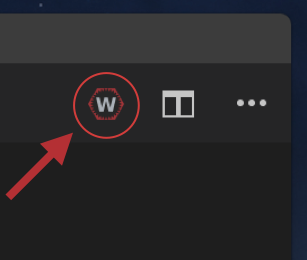
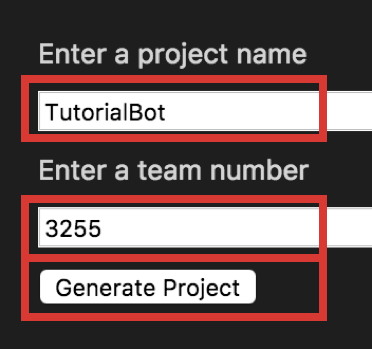

# Creating a Basic Driving Robot

Lets get moving

> <a href="http://ljrobotics.org/games/power-up-2018/" target="_blank">Picture source: Team 2984</a>

## Overview

In this section we will be going over:

1. Creating new subsystems, in this case the basic Drivetrain subsystem
2. Adding subsystems to Robot.java, the main file that the robot runs and all other files must be in some way connected to.
3. Creating joysticks and using their axes to control the robot.
4. Creating and using DifferentialDrive and ArcadeDrive to make controlling the robot’s motors an easy process.
5. Deploying code to the roboRIO

***

## Creating the Drivetrain Subsystem

### Creating a New Project

!!! summary ""
	1) Select the W icon from the tab bar or use the shortcut by holding down **Ctrl+Shift+P** at the same time. (Replace ctrl with cmd on macOS)  
	

!!! summary ""
	2) Type and hit enter or select **WPILib: Create a new project**
	

!!! summary ""
	3) Click **Select a Project Type** and choose **Template**  
	4) Click **Select a Language** and choose **Java**  
	5) Click **Select a project base** and choose **Command Robot**  
	

!!! summary ""
	6) Click **Select a new project folder** and choose where on your computer you would like to store the program
	

!!! summary ""
	7) **Enter a project name** in the text field labeled as such  
	8) **Enter your team number** in the text field labeled as such  
	9) Select **Generate Project**  
	

!!! summary ""
	10) When prompted **“Would you like to open the folder?”**, select **Yes (Current Window)**
	
