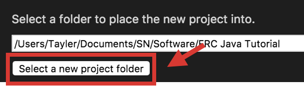

# Creating Project Files

Lets get started

## Overview

Before we can start progrmming a robot, we must create a new project in Visual Studio Code (VSCode). This section will go over:

- [Creating a New Project](#creating-a-new-project)
- [Creating a New Subsystem](#creating-a-new-subsystem)
- [Creating a New Command](#creating-a-new-command)

## Creating a New Project

!!! summary ""
	1) Select the W icon from the tab bar or use the shortcut by holding down **Ctrl+Shift+P** at the same time. (Replace ctrl with cmd on macOS)  
	
	

!!! summary ""
	1) Type and hit enter or select **WPILib: Create a new project**
	
	

!!! summary ""
	1) Click **Select a Project Type** and choose **Template**  
	2) Click **Select a Language** and choose **Java**  
	3) Click **Select a project base** and choose **Command Robot**  
	
	

!!! summary ""
	1) Click **Select a new project folder** and choose where on your computer you would like to store the program
	
	

!!! summary ""
	1) **Enter a project name** in the text field labeled as such  
	2) **Enter your team number** in the text field labeled as such  
	3) Select **Generate Project**  
	
	

!!! summary ""
	1)  When prompted **“Would you like to open the folder?”**, select **Yes (Current Window)**
	
	

## Creating a New Subsystem

!!! summary ""
	1) Double click on the src folder to expand it.  
	2) Do the same for subsystems
	
	

!!! summary ""
	3) Right click on subsystems and select Create a new class/ command.
	
	
	
!!! summary ""
	4) Select Subsystem and type your DesiredSubsystemName (i.e. Drivetrain) for the name and hit enter on your keyboard.
	
	

!!! summary ""
	5) Click on the newly create **Desired_Subsystem_Name.java** (or **Drivetrain.java** if you named it that)
	
	

***

### Adding the Subsystem to Robot.java

!!! warning "Do not forget this step!"
	When a robot program runs on the roboRIO it only runs the main file Robot.java and anything Robot.java links to.  
	We have created a new subsystem but we have not yet linked it to Robot.java.  

	!!! danger "***We must do this for EVERY subsystem we create***"

!!! summary ""
	1) In Robot.java we will create a new **global** variable of type `DesiredSubsystemName` (i.e. `Drivetrain`) named `m_desiredSubsystemName` (`i.e. m_drivetrain`) and set its value to `null`.  
    
	

!!! summary ""
	2) In the `robotInit()` method add: `m_desiredSubsystemName = new DesiredSubsystemName();` (i.e. `m_drivetrain = new Drivetrain();`)
    
	!!! warning "Important"
    	This must always be done above **OI** and **Telemetry/SmartDashboard** (if present).

	
	
Now when we use this subsystem in commands, we must call `Robot.m_desiredSubsystemName.` to get access to it and its methods. (i.e. `Robot.m_drivetrain.someMethod()`)

## Creating a New Command
<!-- TODO: Work in progress -->
Click on the src folder to expand it. Do the same for commands  
Right click on commands and select Create a new class/ command.  
Select Command and type DriveArcade for the name and hit enter on your keyboard.  
Click on the newly create DriveArcade.java  