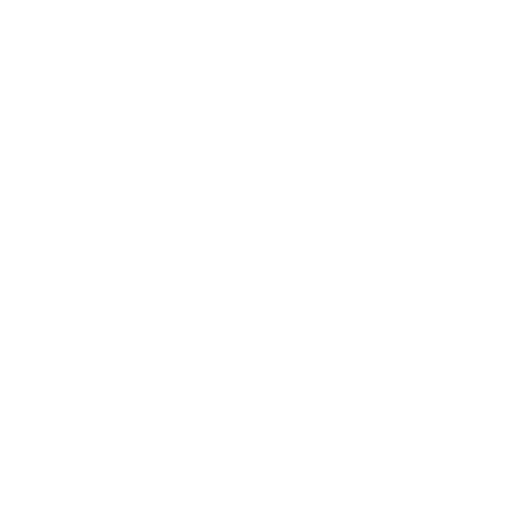

# Installing Necessary Software

Lets get started

{: style="height:150px"}
{: style="height:150px"}
{: style="height:150px"}
{: style="height:150px"}

## Overview

Before we can start programing a robot we must install the necessary software for programming and driving the robot.

!!! tip
	You can install both the **Development Tools** and the **FRC Game Tools** on the same computer or separate computers. However many teams (3255 included) have a development laptop (with both) and a dedicated driverstation laptop (with only the FRC Game Tools) that often stays disconnected from the internet.
***

## Installing Java Development Tools

If all you are doing is writing and deploying code to a robot, all you need are the development tools. Following the instructions linked below will get you set up with a development environment and get you setup with all the tools necessary to **program** a robot.

### Installing Java and Visual Studio Code (VSCode)

For **Windows, macOS, or Linux:**

[Official FRC installation guide (Windows, macOS, or Linux)](https://docs.wpilib.org/en/stable/docs/getting-started/getting-started-frc-control-system/wpilib-setup.html){target=_blank}

!!! Warning "IMPORTANT NOTE"
	These tools only allow you to program and deploy code to an already imaged roboRIO. They do not allow you to drive the robot or image/update the roboRIO. To accomplish those tasks you must install the [FRC Game Tools](#installing-the-frc-game-tools).

***

## Installing the FRC Game Tools

If all you are doing is driving an already programmed robot or imaging/updating the roboRIO all you need is the FRC Game Tools. Following the instructions linked below will get you set up with the tools to **drive** the robot and **image/update** the roboRIO.

### Installing the Driverstation software and roboRIO imaging tool

For **Windows ONLY:**

[Official FRC installation guide (Windows only)](https://docs.wpilib.org/en/stable/docs/getting-started/getting-started-frc-control-system/frc-game-tools.html){target=_blank}

!!! Warning "IMPORTANT NOTE"
	These tools only allow you to drive the robot and image/update a roboRIO. They do not allow you to program the robot. To accomplish those tasks you must install the [Java Development Tools](#installing-java-development-tools).

***

## Installing the FRC Radio Configuration Utility

In order to enable wireless connectivity to the robot outside of FRC events or to allow connectivity to other network attached devices (i.e.Limelight Vision Camera), you must configure the robot's radio. Following the instructions linked below will get you set up with the Radio configuration Utility and how to program the radio.

### Installing the Radio Configuration Utility and Programming the Radio

For **Windows ONLY:**

[Official FRC Radio Configuration Utility and Use guide (Windows only)](https://docs.wpilib.org/en/stable/docs/getting-started/getting-started-frc-control-system/radio-programming.html){target=_blank}
